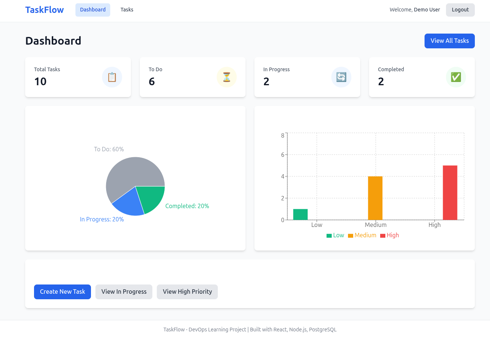

# TaskFlow - DevOps Learning Project




A complete, production-ready task management application designed to teach every major DevOps tool and practice using **100% FREE and open-source resources**.


## 🎯 Project Overview

TaskFlow is a full-stack application built specifically for learning DevOps practices. It demonstrates:

- ✅ **Full Application Stack** - React frontend, Node.js/Express backend, PostgreSQL database
- ✅ **Containerization** - Multi-stage Docker builds, Docker Compose orchestration
- ✅ **CI/CD Pipeline** - GitHub Actions for automated testing and deployment
- ✅ **Kubernetes** - Complete K8s manifests for multiple deployment options
- ✅ **Infrastructure as Code** - Terraform configs for Oracle Cloud, local VMs, and hybrid
- ✅ **Configuration Management** - Ansible playbooks and roles
- ✅ **Monitoring** - Prometheus metrics and Grafana dashboards
- ✅ **Project Management** - GitHub Issues integration

## 🚀 Quick Start

### Prerequisites

- Docker & Docker Compose
- Node.js 18+ (for local development)
- PostgreSQL 13+ (for local development)
- Git

### Run with Docker Compose (Recommended)

The fastest way to get started:

```bash
# Clone the repository
git clone <your-repo-url>
cd TaskFlow

# Start all services
docker-compose up -d

# View logs
docker-compose logs -f

# Access the application
# Frontend: http://localhost:5173
# Backend API: http://localhost:3000
# Grafana: http://localhost:3001 (admin/admin)
# Prometheus: http://localhost:9090
# Adminer (DB UI): http://localhost:8080
```

### Seed Database (Optional)

```bash
# Enter backend container
docker-compose exec backend sh

# Run seed script
npm run seed

# Demo credentials will be displayed:
# Email: demo@taskflow.com
# Password: demo123
```

### Stop Services

```bash
docker-compose down          # Stop services
docker-compose down -v       # Stop and remove volumes (fresh start)
```

## 📁 Project Structure

```
TaskFlow/
├── app/
│   ├── frontend/              ✅ React application (Vite + Tailwind)
│   ├── backend/               ✅ Node.js/Express API
│   └── database/              ✅ PostgreSQL schema and migrations
├── infrastructure/            ✅ Terraform configurations
│   ├── oracle-cloud/          - Oracle Cloud Always Free tier
│   ├── local-vms/             - VirtualBox VMs with Vagrant
│   └── hybrid/                - Mix of free cloud services
├── configuration/             ✅ Ansible playbooks
├── kubernetes/                ✅ K8s manifests
│   ├── local-minikube/        - Minikube configs
│   ├── oracle-k3s/            - K3s for Oracle Cloud
│   └── hybrid/                - Hybrid deployment
├── .github/workflows/         ✅ CI/CD pipelines (GitHub Actions)
├── monitoring/                ✅ Prometheus & Grafana
│   ├── prometheus/
│   └── grafana/
├── docs/                      ✅ Comprehensive documentation
└── scripts/                   ✅ Automation scripts

✅ = Complete | 🔄 = In Progress | ⏳ = Planned
```

## 🛠️ Technology Stack

### Application
- **Frontend**: React 18, Vite, Tailwind CSS, Axios, React Router, Recharts
- **Backend**: Node.js, Express, JWT authentication, Prometheus metrics
- **Database**: PostgreSQL 15 with optimized indexes
- **Caching**: Redis (ready for integration)

### DevOps Tools
- **Containers**: Docker, Docker Compose
- **Orchestration**: Kubernetes (K3s, Minikube)
- **IaC**: Terraform (Oracle Cloud, VirtualBox)
- **Configuration**: Ansible
- **CI/CD**: GitHub Actions
- **Monitoring**: Prometheus, Grafana
- **Logging**: Winston
- **Security**: Helmet, bcrypt, rate limiting

## 🎓 Learning Path

TaskFlow is designed for progressive learning:

### Phase 1: Local Development (✅ COMPLETE)
- Set up the application with Docker Compose
- Understand the codebase structure
- Make changes and see them in action

### Phase 2: Git Workflow & CI/CD (✅ COMPLETE)
- GitHub Issues for project management
- Git branching strategies
- Automated testing and deployment

### Phase 3: Infrastructure as Code (✅ COMPLETE)
- Provision cloud resources with Terraform
- Manage configuration with Ansible
- Deploy to Oracle Cloud (Always Free tier)

### Phase 4: Kubernetes (✅ COMPLETE)
- Deploy to Minikube locally
- Deploy to K3s on Oracle Cloud
- Learn scaling, rolling updates, monitoring

### Phase 5: Monitoring & Observability (✅ COMPLETE)
- Prometheus metrics collection
- Grafana dashboard creation
- Alerting setup

### Phase 6: Production Readiness (✅ COMPLETE)
- Security hardening
- Backup and recovery
- Load testing and optimization

## 📚 Documentation

- [Frontend README](app/frontend/README.md) - React application details
- [Backend README](app/backend/README.md) - API documentation
- [Database README](app/database/README.md) - Schema and migrations

### Comprehensive Guides (Coming Soon)
- **FREE-DEPLOYMENT-OPTIONS.md** - All free deployment options compared
- **ORACLE-CLOUD-SETUP.md** - Complete Oracle Cloud tutorial
- **LOCAL-SETUP.md** - Local development guide
- **ARCHITECTURE.md** - System architecture and design decisions
- **DEVOPS-WORKFLOW.md** - Complete workflow from idea to production
- **Tool Guides** - Docker, Kubernetes, Terraform, Ansible, Git, Prometheus, Grafana

## 🆓 Free Deployment Options

### Option 1: 100% Local (No Cloud Account)
- **Cost**: $0
- **Requirements**: 8GB RAM, 50GB disk
- **Tools**: Docker Desktop, Minikube, VirtualBox
- **Best for**: Learning without internet dependency

### Option 2: Oracle Cloud Always Free (RECOMMENDED)
- **Cost**: $0 forever
- **Resources**: 4 ARM VMs (24GB RAM total), 200GB storage, load balancer
- **Best for**: Real cloud experience with generous resources

### Option 3: Hybrid Free Services
- **Frontend**: Vercel (unlimited free projects)
- **Backend**: Railway ($5/month credit)
- **Database**: Supabase (500MB PostgreSQL) or MongoDB Atlas (512MB)
- **Best for**: Simple deployment with managed services

## 🔧 Local Development

### Frontend Development

```bash
cd app/frontend
npm install
cp .env.example .env
npm run dev
```

### Backend Development

```bash
cd app/backend
npm install
cp .env.example .env

# Create database
createdb taskflow
npm run migrate:up

# Start server
npm run dev
```

## 📊 API Endpoints

### Authentication
- `POST /api/auth/register` - Register new user
- `POST /api/auth/login` - Login
- `GET /api/auth/me` - Get current user

### Tasks
- `GET /api/tasks` - List tasks (with filters)
- `GET /api/tasks/:id` - Get single task
- `GET /api/tasks/stats` - Get statistics
- `POST /api/tasks` - Create task
- `PUT /api/tasks/:id` - Update task
- `DELETE /api/tasks/:id` - Delete task

### Health & Metrics
- `GET /health` - Health check
- `GET /metrics` - Prometheus metrics

## 🔒 Security Features

- JWT-based authentication
- Bcrypt password hashing
- CORS protection
- Helmet security headers
- Rate limiting
- Input validation
- SQL injection prevention
- XSS protection

## 🎯 Project Goals

1. **Educational**: Learn DevOps tools hands-on
2. **Practical**: Build a real, usable application
3. **Free**: Use only free/open-source tools
4. **Complete**: Cover the entire DevOps lifecycle
5. **Production-Ready**: Apply best practices

## 🤝 Contributing

This is a learning project, but contributions are welcome!

1. Fork the repository
2. Create a feature branch
3. Make your changes
4. Submit a pull request

See [CONTRIBUTING.md](CONTRIBUTING.md) for detailed guidelines *(to be created)*.

## 📈 Roadmap

- [x] Core application (frontend, backend, database)
- [x] Docker containerization
- [x] Docker Compose orchestration
- [x] GitHub Issues templates and automation
- [x] Git hooks and workflow automation
- [x] GitHub Actions CI/CD pipeline
- [x] Kubernetes manifests (Minikube + K3s + Oracle + Hybrid)
- [x] Terraform configurations (Oracle Cloud + VirtualBox + Hybrid)
- [x] Ansible playbooks and roles
- [x] Prometheus monitoring setup
- [x] Grafana dashboards
- [x] Comprehensive documentation
- [x] Tool-specific guides (Docker, Kubernetes, Terraform, Ansible, Git, Monitoring)
- [x] Unit and integration tests (backend and frontend)
- [x] Production readiness (Security, Backup/Recovery, Load Testing)
- [x] Disaster recovery procedures
- [x] Performance optimization guide
- [x] Production deployment checklist
- [x] Monitoring and alerting configuration
- [ ] Learning exercises and challenges
- [ ] Video tutorials

## 🐛 Troubleshooting

### Docker Issues

```bash
# Rebuild containers
docker-compose up --build

# View logs
docker-compose logs -f [service-name]

# Reset everything
docker-compose down -v
docker system prune -a
```

### Database Issues

```bash
# Access PostgreSQL
docker-compose exec postgres psql -U taskflow_user -d taskflow

# Reset database
docker-compose down -v
docker-compose up -d postgres
```

## 📝 License

MIT License - See [LICENSE](LICENSE) file for details

## 🌟 Acknowledgments

Built as a comprehensive DevOps learning resource, demonstrating:
- Modern web application architecture
- Container-based development
- Infrastructure as Code principles
- Continuous Integration/Deployment
- Monitoring and observability
- All using FREE resources!

## 📧 Support

- Create an [Issue](../../issues) for bugs or questions
- Check [Discussions](../../discussions) for community help
- Read the docs in `/docs` directory

---

**Happy Learning! 🚀**

*Remember: The best way to learn DevOps is by doing. This project gives you everything you need to practice in a real-world scenario.*
